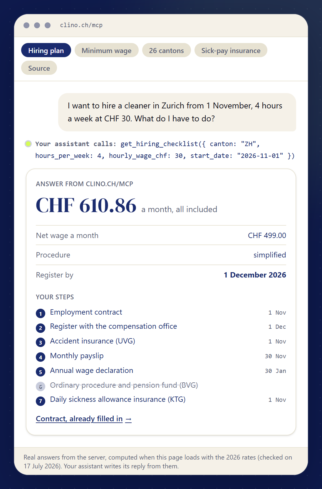
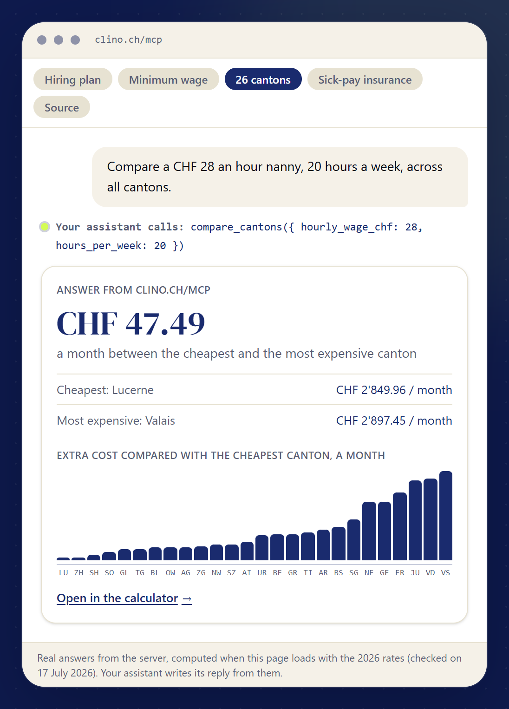

# Clino MCP server: Swiss household employment

A free, read-only [Model Context Protocol](https://modelcontextprotocol.io) server that gives AI assistants the rules, rates and deadlines for employing household help in Switzerland (cleaner, nanny, carer), for all 26 cantons, with the official source behind every figure.

**Endpoint:** `https://clino.ch/mcp` (Streamable HTTP, no sign-in, no API key)
**Docs and live demo:** [clino.ch/en/mcp](https://clino.ch/en/mcp)
**Official MCP Registry:** `ch.clino/household-employment`

Ask your assistant things like:

- *"I want to hire a cleaner in Zurich, 6 hours a week at CHF 30. What does it cost me and what do I have to do?"*
- *"Our nanny starts in Geneva on 1 November, 20 hours a week. Give me the plan with dates."*
- *"Is CHF 22 an hour legal for a cleaner in Basel?"*
- *"In which canton is a household employee cheapest for the employer?"*

<p align="center"> </p>

The answers come from the same calculator and canton data that run [clino.ch](https://clino.ch), checked against the official sources (AHV/IV leaflets, cantonal minimum-wage laws, NAV standard contracts, compensation offices).

## Connect

| Client | How |
|---|---|
| **Claude** (claude.ai, Desktop) | Settings → Connectors → Add custom connector → URL `https://clino.ch/mcp` |
| **ChatGPT** | Settings → Apps & Connectors → Advanced settings: developer mode on, then Create → URL `https://clino.ch/mcp`, no authentication |
| **Claude Code** | `claude mcp add --transport http clino https://clino.ch/mcp` |
| **Cursor** | [One-click install](https://clino.ch/en/mcp#cursor) or the JSON below in `~/.cursor/mcp.json` |
| **VS Code** | [One-click install](https://clino.ch/en/mcp#vscode) or `.vscode/mcp.json` below |
| **Other clients** | Any client that speaks Streamable HTTP: URL `https://clino.ch/mcp` |

Generic (`mcpServers`):

```json
{
  "mcpServers": {
    "clino": { "url": "https://clino.ch/mcp" }
  }
}
```

VS Code (`.vscode/mcp.json`):

```json
{
  "servers": {
    "clino": { "type": "http", "url": "https://clino.ch/mcp" }
  }
}
```

## Tools

All tools are read-only (`readOnlyHint: true`), return structured content with an output schema, and answer in German, English, French, Italian, Spanish or Portuguese.

| Tool | What it answers |
|---|---|
| `get_hiring_checklist` | The plan for one case: steps with real dates (registration deadline, first payslip, annual declaration), cost, net wage, minimum-wage check, insurance, the canton's forms |
| `estimate_employer_cost` | Monthly and annual employer cost and the worker's net wage, line by line (AHV/IV/EO, ALV, FAK, UVG, withholding tax, BVG), simplified or ordinary procedure |
| `compare_cantons` | The same job priced in all 26 cantons |
| `get_minimum_wage` | The binding floor for household work: cantonal minimum wage (GE, NE, JU, TI, BS) or the NAV standard contract, by skill level |
| `get_canton_rules` | One canton: compensation office and its registration form, contribution rates, family allowances, sick pay scale, daily sickness insurance (KTG), withholding tax, childcare deduction |
| `get_employer_guide` | What a household employer has to do, step by step, by role (cleaner, nanny, carer) |
| `get_official_sources` | The official documents behind the figures, with the exact quote and the date it was checked |
| `search` / `fetch` | Search and read Clino's canton pages, guides and source notes (the pair ChatGPT connectors expect) |

Two prompts are included: `hiring_plan` (plan for employing someone) and `check_my_wage` (for workers: is my wage legal, what should my payslip show).

See [`examples/`](examples) for full requests and responses.

## Open data

The figures the server uses are published here under **CC BY 4.0** (attribution: Clino, clino.ch):

| File | Content |
|---|---|
| [`data/official-figures-2026.csv`](data/official-figures-2026.csv) / [`.json`](data/official-figures-2026.json) | 151 figures (contribution rates, thresholds, minimum wages, allowances), each with source document, URL, verbatim quote and verification date |
| [`data/canton-summary-2026.csv`](data/canton-summary-2026.csv) | One row per canton: compensation office, family allowance fund rate, admin fee, child and education allowances, minimum wage from 5 h/week, KTG obligation, sick pay scale |
| [`data/canton-rules-2026.json`](data/canton-rules-2026.json) | The full canton rules as the server returns them, 26 cantons |

Rates year 2026, last verified against the official sources on the date in each file. The live server is updated when the authorities publish new figures; this snapshot may lag. Corrections are welcome as issues.

The human-readable version of the sources is at [clino.ch/en/sources](https://clino.ch/en/sources).

## Privacy

The server needs no account and has no access to the assistant's conversations, memory or files. The details a tool call sends (canton, postcode, wage, hours) are used only to compute the answer and are not stored. The usage log keeps the tool name, canton, language, role and the client's name, with no IP address and no free text. Full text: [clino.ch/en/privacy](https://clino.ch/en/privacy).

## Limits

General information, not legal advice. Figures for 2026. The server prepares nothing and files nothing: registration with the compensation office, payslips and declarations remain the household's own steps.

## About Clino

[Clino](https://clino.ch) helps private households in Switzerland employ a cleaner, nanny or carer legally: it prepares the employment contract and the monthly payslips, calculates the contributions, guides the registration with the compensation office and produces the annual wage declaration. Free tools: [salary calculator](https://clino.ch/en/calculator), [employment contract](https://clino.ch/en/employment-contract-cleaner), [registration by canton](https://clino.ch/en/register-cleaner-switzerland).

Contact: [clino.ch/en/contact](https://clino.ch/en/contact)
